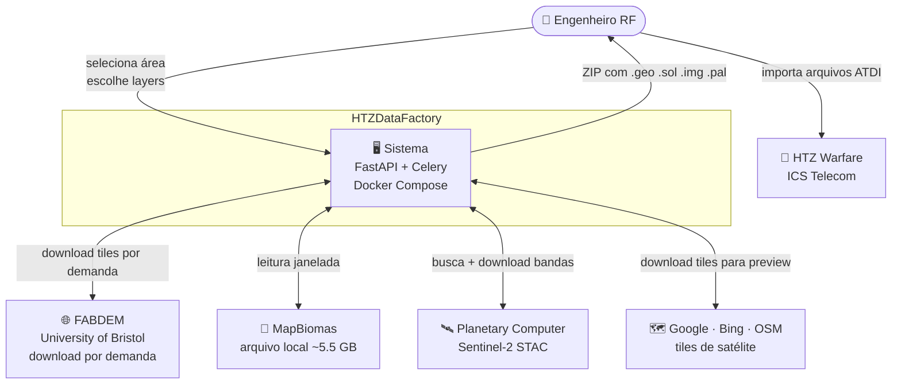
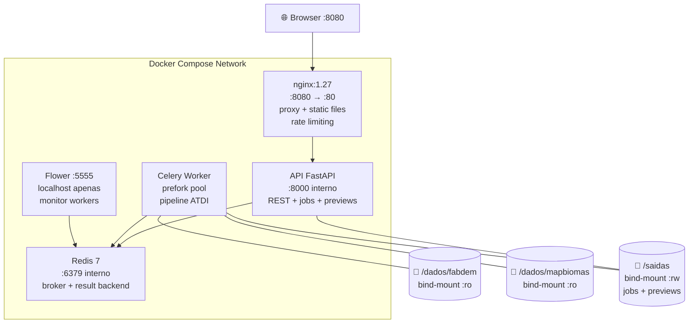
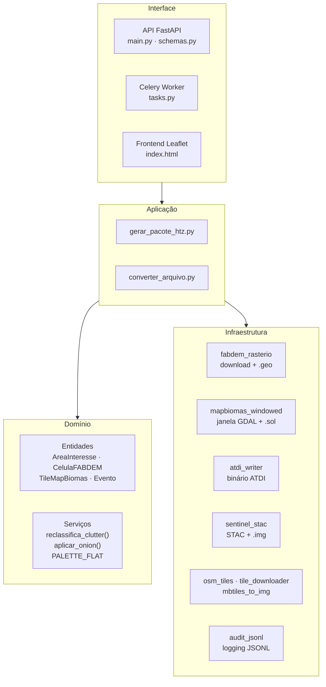
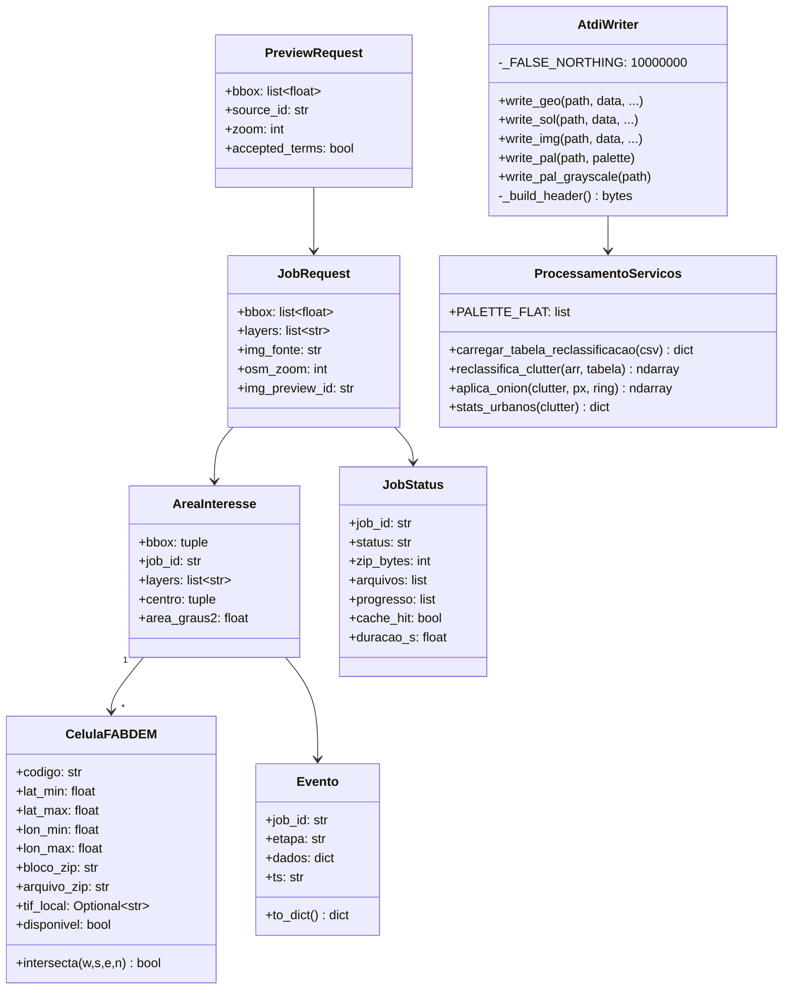
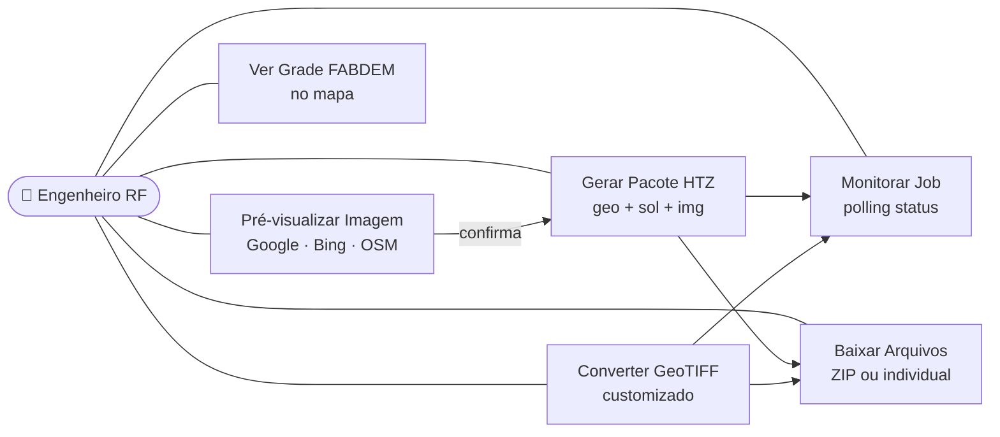
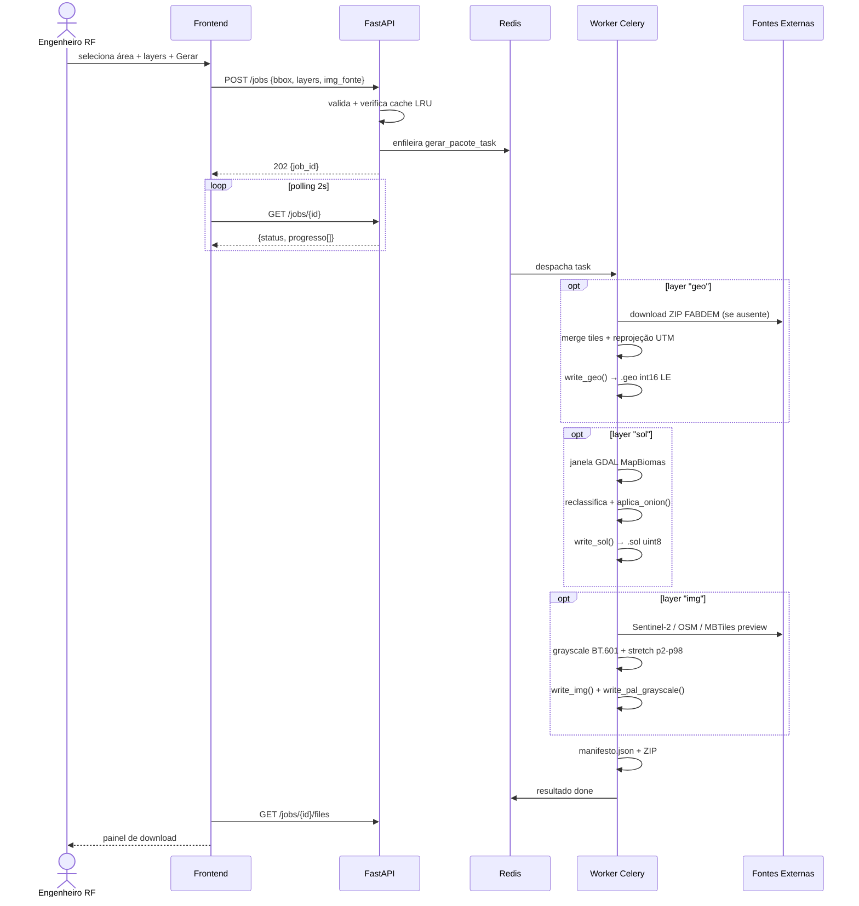
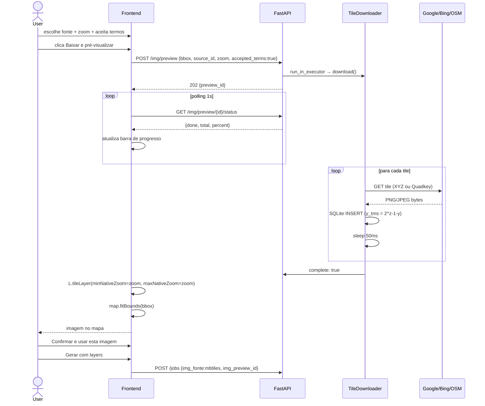
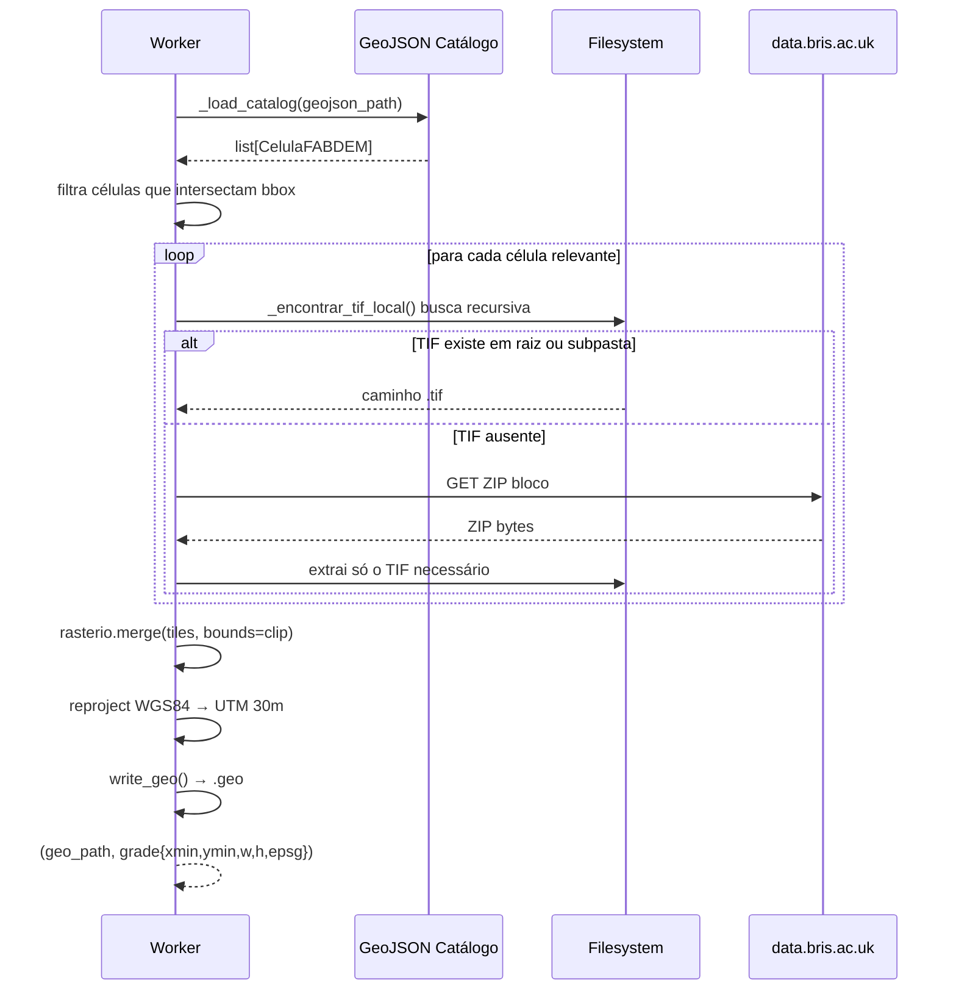
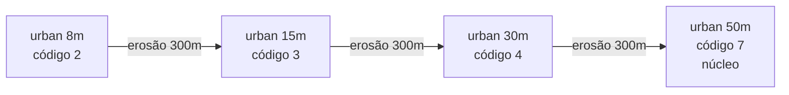

# HTZDataFactory — Documentação Técnica

> Gerador de arquivos ATDI binários (`.geo`, `.sol`, `.img`, `.pal`) para HTZ Warfare / ICS Telecom a partir de dados abertos — FABDEM, MapBiomas e imagens de satélite.

**Versão:** 1.3.0 · **Stack:** Python 3.11 · FastAPI · Celery · Redis · Rasterio · Docker

---

## Sumário

- [Visão Geral](#visão-geral)
- [Arquitetura — Contexto (C4 L1)](#arquitetura--contexto-c4-l1)
- [Arquitetura — Containers (C4 L2)](#arquitetura--containers-c4-l2)
- [Camadas DDD](#camadas-ddd)
- [Diagrama de Classes](#diagrama-de-classes)
- [Casos de Uso](#casos-de-uso)
- [Sequência — Gerar Pacote HTZ](#sequência--gerar-pacote-htz)
- [Sequência — Preview de Tiles](#sequência--preview-de-tiles)
- [Sequência — Download FABDEM](#sequência--download-fabdem)
- [Estrutura de Arquivos](#estrutura-de-arquivos)
- [Formato Binário ATDI](#formato-binário-atdi)
- [API Reference](#api-reference)
- [Configuração (.env)](#configuração-env)
- [Docker Compose](#docker-compose)
- [Tabela MapBiomas → ATDI](#tabela-mapbiomas--atdi)
- [Procedimentos](#procedimentos)
- [Troubleshooting](#troubleshooting)

---

## Visão Geral

| Item | Detalhe |
|------|---------|
| **DEM** | FABDEM v1.2 — University of Bristol (CC-BY-4.0) |
| **Clutter** | MapBiomas Collection 10 2023 (CC-BY-4.0) |
| **Imagem** | Sentinel-2 L2A · Google Satellite · Bing Satellite · OpenStreetMap |
| **Saídas** | `.geo` int16 30 m · `.sol` uint8 30 m · `.img` uint8 15 m · `.pal` 7200 bytes |
| **Arquitetura** | Docker Compose · DDD · Celery workers · Redis broker |
| **Frontend** | Leaflet.js — mapa interativo, preview de tiles, download |

---

## Arquitetura — Contexto (C4 L1)



---

## Arquitetura — Containers (C4 L2)



---

## Camadas DDD



---

## Diagrama de Classes



---

## Casos de Uso



| Caso de Uso | Pré-condição | Resultado |
|-------------|-------------|-----------|
| Gerar Pacote HTZ | Área selecionada, layers válidos, dados disponíveis | ZIP com `.geo .sol .img .pal manifesto.json audit.jsonl` |
| Pré-visualizar Imagem | Área selecionada, fonte escolhida, termos aceitos | Tiles no mapa para aprovação visual |
| Converter GeoTIFF | Arquivo `.tif` válido (DEM/clutter/imagem) | Arquivo ATDI correspondente |
| Monitorar Job | Job criado (pending/running) | Log de progresso em tempo real |
| Baixar Arquivos | Job concluído (done) | ZIP completo ou arquivo individual |

---

## Sequência — Gerar Pacote HTZ



---

## Sequência — Preview de Tiles



---

## Sequência — Download FABDEM



---

## Estrutura de Arquivos

```
HTZDataFactory/
├── docker-compose.yml          # 5 serviços
├── Dockerfile                  # python:3.11-slim + GDAL
├── requirements.txt
├── .env.example                # template de configuração
├── config/
│   └── mapbiomas_atdi.csv      # tabela reclassificação (editável sem rebuild)
├── nginx/
│   └── nginx.conf              # proxy, rate limits, security headers
├── docs/
│   ├── index.html              # documentação interativa (local)
│   └── DOCUMENTACAO.md         # esta documentação (GitHub)
├── dados/
│   ├── fabdem/                 # GeoJSON + tiles .tif + blocos .zip
│   └── mapbiomas/              # TIF collection 10 ~5.5 GB
├── saidas/                     # jobs ZIP + previews MBTiles
├── frontend/
│   └── index.html              # SPA Leaflet
└── src/
    ├── dominio/
    │   ├── area_interesse/entidades.py
    │   ├── catalogo/entidades.py
    │   ├── processamento/servicos.py   # clutter, onion, PALETTE_FLAT
    │   └── auditoria/entidades.py
    ├── aplicacao/casos_uso/
    │   ├── gerar_pacote_htz.py         # orquestrador principal
    │   └── converter_arquivo.py        # converte GeoTIFF customizado
    ├── infraestrutura/adaptadores/
    │   ├── atdi_writer.py              # writer binário ATDI
    │   ├── fabdem_rasterio.py          # download + .geo
    │   ├── mapbiomas_windowed.py       # janela GDAL + .sol
    │   ├── sentinel_stac.py            # Sentinel-2 + .img
    │   ├── osm_tiles.py                # OSM tiles + .img
    │   ├── tile_downloader.py          # Google/Bing/OSM → MBTiles
    │   └── mbtiles_to_img.py           # MBTiles → .img ATDI
    └── interface/
        ├── api/main.py                 # FastAPI + endpoints
        ├── api/schemas.py              # Pydantic schemas
        └── worker/tasks.py             # Celery task
```

---

## Formato Binário ATDI

### Header (1010 bytes) — mesmo para .geo, .sol, .img

| Offset | Tamanho | Conteúdo |
|--------|---------|---------|
| 0–159 | 160 | Zeros (padding) |
| 160–~279 | variável | 4 cantos UTM em ASCII: `{x:.6f}\x00\x00{y:.6f}` (NW→NE→SW→SE) |
| ~280–~300 | variável | pixel_size_x`\x00` pixel_size_y`\x00` |
| 300 | 1 | `'M'` (metros) |
| 320–323 | 4 | largura em pixels (ASCII decimal) |
| 330–333 | 4 | altura em pixels (ASCII decimal) |
| 340–348 | 9 | `'4UTN{zona:02d} 00'` |
| 371–378 | 8 | `'UTN{zona:02d} 00'` |
| 415–417 | 3 | `'IMG'` |
| 515, 530… (8×) | 8×8 | `'0.000000'` (offsets geocêntricos) |
| 1009 | 1 | `0x1A` (EOF marker DOS) |

### Dados após o Header

| Arquivo | Tipo | Bytes/px | Conteúdo |
|---------|------|---------|---------|
| `.sol` | uint8 | 1 | código clutter ATDI 0–11 |
| `.geo` | int16 LE | 2 | elevação metros (Y negativo HS) |
| `.img` | uint8 | 1 | luminância grayscale 1–255 (0=nodata) |

> ⚠️ **False Northing:** EPSG:327xx adiciona 10.000.000 m ao Y. O ATDI espera Y negativo.  
> Correção: `y_atdi = y_epsg − 10.000.000`

### Formato .pal (7200 bytes)

```
240 entradas × 30 bytes = 7200 bytes
Por entrada: canal R (10 bytes) + canal G (10 bytes) + canal B (10 bytes)
Por campo: str(valor).encode('ascii') + b'\x00' * (10 - len(str(valor)))

Exemplos:
  valor=0   → b'0\x00\x00\x00\x00\x00\x00\x00\x00\x00'
  valor=31  → b'31\x00\x00\x00\x00\x00\x00\x00\x00'
  valor=240 → b'240\x00\x00\x00\x00\x00\x00\x00'
```

> ℹ️ O `.pal` acompanha **exclusivamente o `.img`**. O `.sol` não usa `.pal` — o HTZ gerencia as cores de clutter internamente.

---

## API Reference

### /jobs

| Método | Rota | Descrição |
|--------|------|---------|
| `POST` | `/jobs` | Cria job. Body: `JobRequest`. Retorna 202 `JobStatus` |
| `GET` | `/jobs/{job_id}` | Status + log de progresso |
| `GET` | `/jobs/{job_id}/download` | Download ZIP completo |
| `GET` | `/jobs/{job_id}/files` | Lista arquivos com URLs individuais |
| `GET` | `/jobs/{job_id}/download/{filename}` | Arquivo individual |
| `GET` | `/jobs/{job_id}/audit` | Histórico JSONL de auditoria |
| `GET` | `/jobs` | Lista todos os jobs |

**JobRequest:**
```json
{
  "bbox": [-47.5, -16.0, -47.0, -15.5],
  "layers": ["geo", "sol", "img"],
  "img_fonte": "sentinel2",
  "osm_zoom": 15,
  "img_preview_id": null
}
```

### /img/preview

| Método | Rota | Descrição |
|--------|------|---------|
| `GET` | `/img/sources` | Lista fontes de tiles (Google, Bing, OSM) com metadados |
| `POST` | `/img/preview` | Inicia download tiles → MBTiles. Retorna 202 `{preview_id}` |
| `GET` | `/img/preview/{id}/status` | Progresso: `{done, total, percent, status}` |
| `GET` | `/img/preview/{id}/tile/{z}/{x}/{y}` | Serve tile PNG/JPEG do MBTiles |
| `DELETE` | `/img/preview/{id}` | Remove preview e apaga MBTiles |

### Outros

| Método | Rota | Descrição |
|--------|------|---------|
| `GET` | `/health` | Health check: `{fabdem_ok, mapbiomas_ok, csv_ok}` |
| `GET` | `/status` | Status das camadas disponíveis |
| `POST` | `/convert` | Converte GeoTIFF customizado (form-data: file, tipo) |
| `GET` | `/tiles/fabdem` | GeoJSON 810 células FABDEM com status local |
| `GET` | `/tiles/mapbiomas` | GeoJSON bbox MapBiomas local |
| `DELETE` | `/cache` | Limpa cache LRU (requer X-API-Key) |

---

## Configuração (.env)

| Variável | Obrig. | Padrão | Descrição |
|----------|--------|--------|---------|
| `FABDEM_DIR` | ✅ | — | Pasta com GeoJSON catálogo + tiles |
| `MAPBIOMAS_DIR` | ✅ | — | Pasta com TIF MapBiomas |
| `MAPBIOMAS_FILENAME` | ✅ | `mapbiomas_10m_...tif` | Nome exato do arquivo TIF |
| `HTZ_API_KEY` | — | `""` | Chave para DELETE /cache |
| `FLOWER_USER` | — | `admin` | Usuário Flower |
| `FLOWER_PASSWORD` | ⚠️ | `troque_aqui` | Senha Flower |
| `HTTP_PORT` | — | `8080` | Porta nginx |
| `GDAL_CACHEMAX` | — | `4096` | Cache GDAL em MB (~25% RAM) |
| `MAX_CONCURRENT_JOBS` | — | `4` | Jobs simultâneos |
| `WORKER_CONCURRENCY` | — | `4` | Processos Celery por worker |
| `WORKER_MEMORY_LIMIT` | — | `8G` | Limite de memória do worker |

---

## Docker Compose

| Serviço | Imagem | Porta | Volumes |
|---------|--------|-------|---------|
| `api` | build local | 8000 (interno) | /dados/fabdem:ro · /dados/mapbiomas:ro · ./saidas · ./src:ro · ./frontend:ro |
| `worker` | build local | — | mesmos da api |
| `redis` | redis:7-alpine | 6379 (interno) | redis_data |
| `nginx` | nginx:1.27-alpine | **8080→80** | ./nginx/nginx.conf · ./frontend · ./docs |
| `flower` | mher/flower:2.0 | **localhost:5555** | — |

**Nginx — Rate Limits:**

| Zona | Rate | Burst | Endpoints |
|------|------|-------|---------|
| `api_general` | 20 r/s | 40 | padrão |
| `job_create` | 2 r/s | 5 | POST /jobs |
| `upload` | 1 r/s | 3 | POST /convert |
| `tile_serve` | 200 r/s | 500 | /img/preview/*/tile/* |

---

## Tabela MapBiomas → ATDI

Arquivo: `config/mapbiomas_atdi.csv` — editável sem rebuild.

| Código ATDI | Nome | RGB | MapBiomas mapeados |
|-------------|------|-----|-------------------|
| 0 | open | 240,240,240 | Campo, pastagem, sem dado |
| 1 | suburban | 91,90,238 | — |
| 2 | urban 8m | 90,167,242 | Área urbanizada (base efeito cebola) |
| 3 | urban 15m | 90,243,247 | Efeito cebola — anel 1 |
| 4 | urban 30m | 89,247,172 | Efeito cebola — anel 2 |
| 5 | forest | 96,226,97 | Floresta, mangue, silvicultura |
| 6 | hydro | 138,198,92 | Rios, lagos, campo alagado |
| 7 | urban 50m | 249,248,89 | Efeito cebola — núcleo |
| 8 | wood | 247,184,92 | Cerrado, savana |
| 9 | roof | 241,90,90 | Telhado/edificação |

**Efeito Cebola Urbano:**


---

## Procedimentos

### Primeiro Deploy

```bash
git clone https://github.com/seu-usuario/HTZDataFactory.git
cd HTZDataFactory
cp .env.example .env
# Editar .env: FABDEM_DIR, MAPBIOMAS_DIR, MAPBIOMAS_FILENAME
docker compose up --build -d
curl http://localhost:8080/health
```

### Reinicialização (sem rebuild)

```bash
# Código src/ ou frontend/ mudou:
docker compose restart api worker nginx

# Escalar workers:
docker compose up --scale worker=3 -d
```

### Diagnóstico

```bash
docker compose ps
docker compose logs api --tail=50
docker compose logs worker --tail=50
docker compose exec api ls /dados/fabdem/
docker compose exec redis redis-cli LLEN celery
```

---

## Troubleshooting

| Sintoma | Causa | Solução |
|---------|-------|---------|
| `offline — JSON.parse` | nginx 502 / containers parados | `docker compose restart api worker nginx` |
| `fabdem_ok: false` | GeoJSON catálogo não encontrado | Verificar `FABDEM_DIR` e existência do GeoJSON |
| `mapbiomas_ok: false` | TIF não encontrado | Verificar `MAPBIOMAS_DIR` + `MAPBIOMAS_FILENAME` |
| Job fica `pending` | Worker não consome | `docker compose logs worker` + restart |
| 422 em `POST /img/preview` | `accepted_terms: false` ou bbox inválido | Aceitar termos, verificar bbox ≤ 5°×5° |
| 429 em tiles | Rate limit antigo | Nginx já tem zona `tile_serve` 200r/s |
| Tiles não aparecem no mapa | Zoom Leaflet ≠ zoom dos tiles | `minNativeZoom`/`maxNativeZoom` já configurados |
| Sentinel-2 falha | Sem acesso ao Planetary Computer | Usar Google/Bing/OSM como alternativa |
| .sol com coordenadas erradas | False northing | Confirmar área no HS e bbox `[w,s,e,n]` |

---

*Documentação gerada em 2026 · HTZDataFactory v1.3.0*
